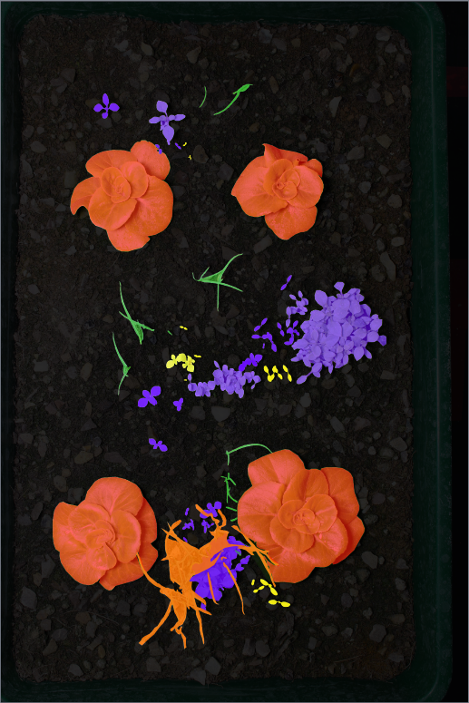

# Post-Spraying Image Evaluation
  

This repository is for the paper **Deep Learning for Precision Agriculture: Post-Spraying Evaluation and Deposition Estimation** (). 

This repository contains the dataset curated. This dataset is made up of 176 images of trays that contain lettuce, chickweed, and meadowgrass pre- and post-spraying from a spot spraying system.

## Related research

| Paper  |  Conference/Journal |
| ------------- |  ------------- |
| [An Agricultural Precision Sprayer Deposit Identification System](https://ieeexplore.ieee.org/document/10260374) |   IEEE International Conference on Automation Science and Engineering (CASE)  |
| [An Automated Precision Spraying Evaluation System](https://link.springer.com/chapter/10.1007/978-3-031-43360-3_3)  |  Towards Autonomous Robotic Systems (TAROS)  |
| [Advancing precision agriculture: domain-specific augmentations and robustness testing for convolutional neural networks in precision spraying evaluation](https://link.springer.com/article/10.1007/s00521-024-10142-0)  |   Neural Computing and Applications  |

## Example Data

  
  

## Data Location
Data can be found at: https://drive.google.com/drive/folders/1rGmiyL8uGXRGBJucdhIXFLKVt2Ot6cP5?usp=sharing

## Data Structure
------------

    ├── PSIE
    ├── annotations
    │   ├── PSIE_train.json
    │   ├── PSIE_test.json
    ├── train
    │   ├── *.JPG  160 images
    │   
    ├── test            
    │   ├── *.JPG 16 images
    

--------

## Authors

Harry Rogers: [LinkTree](https://linktr.ee/harryrogers)

Tahmina Zebin: [Academic Profile](https://www.brunel.ac.uk/people/tahmina-zebin/research) 

Grzegorz Cielniak: [Academic Profile](https://staff.lincoln.ac.uk/gcielniak)  

Beatriz De La Iglesia: [Academic Profile](https://research-portal.uea.ac.uk/en/persons/beatriz-de-la-iglesia)  

Ben Magri: [LinkedIn](https://www.linkedin.com/in/ben-magri-307b52a6/)
